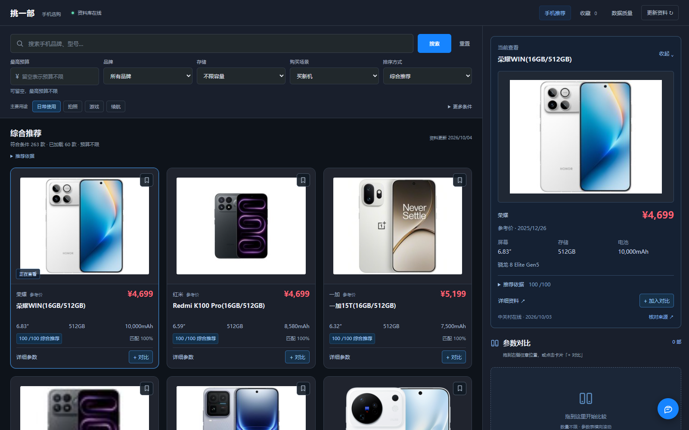
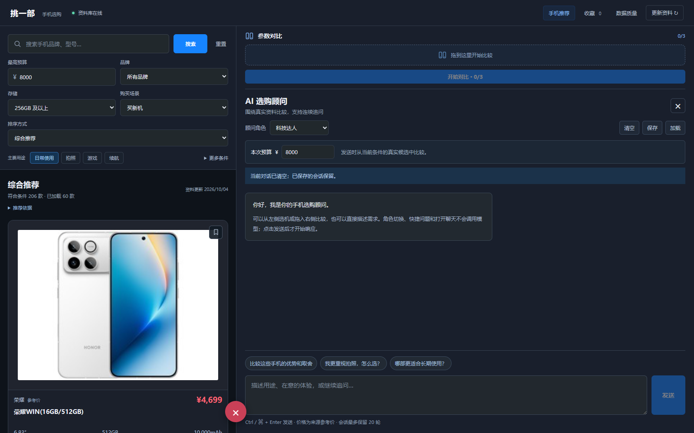

# 挑一部 · 手机选购工作台

[在线产品介绍与交互演示](https://zhong-ze-wei.github.io/phone_show-demo/) · [本地运行](#直接运行) · [清洗策略](docs/CLEANING_STRATEGY.md)

输入自己的预算与用途，找到适合的手机：看大图和规格，收藏、拖拽对比，再让 **DeepSeek-V4.1-Flash** 解释取舍。

这是使用 **Python + uv、SQLite、FastAPI、React** 的本地选购工作台。筛选与对比无需模型；采集品牌官网与 ZOL 的公开资料，自动清洗并保留字段来源。首次预算留空，推荐以用途为主，近一年机型与主流品牌适度加分。

在线介绍页含真实界面截图、动效和可操作的预算／用途、三机对比、顾问录制演示，手机上也能打开。演示使用 2026-10-04 的真实数据快照，不调用模型；完整筛选与连续聊天需启动本地工作台。[展示页源码](site/)与[发布维护说明](docs/PRODUCT_SITE.md)均随项目保存。



点击 AI 球展开连续聊天，左侧仍可浏览手机。整个右栏都能接收拖拽，最多对比三台，不必瞄准右下角。手机端使用单列图卡和底部操作条。



## 直接运行

需要 Git、[uv](https://docs.astral.sh/uv/) 和 Node.js 22.12 或更新版本。首次从 [GitHub 仓库](https://github.com/Zhong-Ze-Wei/phone_show) 克隆，在 PowerShell 执行：

```powershell
git clone https://github.com/Zhong-Ze-Wei/phone_show.git
Set-Location phone_show
uv run python scripts/restore_snapshot.py
.\start.ps1
```

先还原版本数据，再启动页面。已有项目直接运行 `.\start.ps1`；还原脚本检测到已有数据库会保留它，不覆盖。uv 管理 Python 与依赖，启动脚本再安装前端依赖、构建页面并启动服务。浏览器打开 [http://127.0.0.1:8501](http://127.0.0.1:8501)。终端按 `Ctrl+C` 停止。

也可以分步运行：

```powershell
uv sync --link-mode copy
npm --prefix frontend ci
npm --prefix frontend run build
uv run phone-finder
```

`uv run python app.py` 同样启动新版。端口占用时用 `uv run phone-finder --port 8502`。Python 由 uv 管理，依赖由 `uv.lock` 固定；前端依赖由 `frontend/package-lock.json` 固定。

仓库包含约 10.6 MB 的 [压缩数据库快照](data/snapshots/phones.sqlite3.gz)，保存本版 **4,428 条机型配置、5,777 条原始记录快照和 795 条主图修复记录**。还原前校验压缩文件 SHA-256；[清单](data/snapshots/manifest.json)记录版本与校验摘要。运行数据库、外部 HTML 缓存和采集检查点不随 Git 提交。如果未还原且数据库为空，启动会导入随项目保留的 Excel 历史资料。

**版本快照保留原采集和报价核验时间，不会因还原而变新。** 默认推荐仍执行最近 30 天资料与独立报价时效检查；过期或缺价时需点击“更新资料”，或在另一终端执行 `uv run phone-assistant sync --latest` 获取近期机型资料。日常定期执行 `uv run phone-assistant sync` 刷新完整目录与已知报价。

AI 顾问需另外配置自己的密钥，见 [DeepSeek 配置](#deepseek-配置)。不配置密钥也能采集、筛选、收藏与对比。

## 如何快速选

1. 首次打开不预填预算。输入自己的最高预算或主动选择预算档，再选最重要的用途：日常、游戏、拍照或续航。
2. 按需限制品牌、系统、存储容量与轻巧偏好。默认使用最近 30 天抓取、来源标为在售且报价近期核实的记录；上市年龄用于评分，不因旧款年龄直接排除。历史资料是独立探索选项。
3. 默认“综合推荐”：用途规格匹配 75%、预算余量 10%、上市时效 10%、主流品牌偏好 5%。近一年加分，旧款好价仍可能胜过新款。可切换新机优先、仅需求匹配或价格排序。相同机型的容量版本只占一个位置，避免重复结果。
4. 点击图片在预览中看大图、规格和推荐依据；用「+ 对比」或拖到右栏任意位置加入两三款，查看参数与来源，收藏留待后续购买。
5. 点击 AI 球打开顾问，可选择科技达人、生活顾问、性价比专家、商务精英或游戏玩家，连续追问并停止回复。打开、角色切换和快捷填入不调用模型；明确发送时才使用 AIPing 额度。聊天预算与主筛选一致，不会因聊天文字擅自修改。手动保存／加载仅处理本浏览器会话，不恢复旧预算与筛选，不把旧报价当作当前价格。

“新机发现”独立于预算推荐：超预算、报价或容量待核实的机型仍可查看并说明原因。展开全部目录机型，或按品牌、型号搜索定位；选择已核价版本可主动放宽预算。未发售的机型显示待上市，不能进入已上市推荐。官网只有年月时保持该精度；与 ZOL 明确冲突的上市时间按官网核对，同时保留来源原文。

“需求匹配”和“综合推荐”是透明规则计算，**不是跑分或实测排名**；品牌加分也是采购偏好，不证明产品质量或售后。游戏表现、成片画质和真实续航没有实测时会说明。ZOL 报价是参考报价，实际购买前请确认渠道价格、版本与库存。来源未报价格的机型不会按零元进入预算推荐。权重、日期边界和名单详见 [推荐策略](docs/RECOMMENDATION_STRATEGY.md)，顾问每轮的事实、来源与会话规则见 [AI 顾问](docs/AI_CHAT.md)。

“考虑二手”取消上市时效加分，权重为用途 85%、预算余量 10%、品牌 5%，不自动启用历史报价。现有来源没有二手行情、成色、电池健康或保修证据；价格仍为来源参考价，页面仅帮助挑选机型，不能据此确认二手预算与库存。

命令行同样可快速选机：

```powershell
uv run phone-assistant recommend --budget 4000 --priority battery --priority camera
uv run phone-assistant recommend --budget 6000 --brand 小米 --storage 512 --compact
uv run phone-assistant recommend --budget 3000 --history --query vivo
uv run phone-assistant recommend --budget 6000 --query X500 --sort newest
uv run phone-assistant recommend --budget 5000 --purchase-mode used
```

## 更新与自动清洗

```powershell
# 发现已配置的公开列表、容量版本并抓详情；自动清洗和发布
uv run phone-assistant sync

# 开始新的刷新批次
uv run phone-assistant sync --force

# 仅核对官网及品牌新品入口，补齐对应版本；不刷新已有历史目录
uv run phone-assistant sync --latest

# 接续上次未完成批次，保留其已抓取快照的真实时间
uv run phone-assistant sync --resume

# 小批验证，报告会说明覆盖受限
uv run phone-assistant sync --force --limit 10

# 查看覆盖率、缺失和异常
uv run phone-assistant quality

# 清洗策略升级后，用原始快照重新计算，不重新访问网页
uv run phone-assistant clean

# 重新导入旧 Excel；始终标记为历史，不覆盖新鲜来源数据
uv run phone-assistant import-legacy
```

正常同步带请求间隔、有限重试和可恢复检查点；无效响应、验证页面或缺少参数的页面进入失败报告。不会删除整个旧数据库，也不会为了补齐字段而生成参数。普通 `sync` 或 `--force` 获取新快照，`--resume` 接续未完成批次。部分完成退出码为 2，完整完成为 0，执行错误为 1。

图片解析优先使用实际产品主图，避免系列小缩略图覆盖大图。已有缓存可用 `uv run python -m phone_assistant.images --apply --report data/reports/image_replay.json` 离线补图；只修改图片及来源，原报价时间不变，重清洗后保留。先省略 `--apply` 可预览改动。完整依据见 [图片采集与修复](docs/IMAGE_PIPELINE.md)。

## DeepSeek 配置

首次使用 AI 顾问时，复制 `.env.example` 为 `.env`，填入自己的 AIPing 密钥；已有 `.env` 时直接编辑它：

```powershell
Copy-Item .env.example .env
```

```dotenv
AIPING_API_KEY=your-api-key
AIPING_BASE_URL=https://aiping.cn/api/v1
AIPING_MODEL=DeepSeek-V4.1-Flash
AIPING_TIMEOUT=120
```

修改配置后重启服务。环境变量优先于 `.env`；密钥只由 Python 读取，不进入浏览器或日志，`.env` 已被 Git 忽略。请求遵循 [AIPing 文本模型文档](https://aiping.cn/docs/API/text-models)，使用 OpenAI 兼容 SDK 和平台模型 ID，默认关闭思考模式。

```powershell
uv run phone-assistant check-api
uv run phone-assistant status
```

`check-api` 获取模型列表并发送一次真实短请求。常见错误：401 检查密钥，402 检查余额，404/422 检查模型和路由，429 等待后再试。模型不可用时，本地筛选和比较仍可使用。

## 数据与文件

| 路径 | 用途 |
| --- | --- |
| `frontend/` | React 页面、前端测试与构建配置 |
| [`site/`](site/) | 独立静态产品介绍页、真实截图与交互演示，发布至 GitHub Pages |
| `phone_assistant/server.py` | 本地 API 与页面服务 |
| `phone_assistant/crawler.py` | 列表、型号和参数页面解析 |
| `phone_assistant/pipeline.py` | 自动采集、检查点、失败与覆盖报告 |
| `phone_assistant/cleaning.py` | 字段语义、单位、否定语句与异常校验 |
| `phone_assistant/storage.py` | SQLite 原始快照、规范记录与字段来源 |
| `phone_assistant/recommendation.py` | 明确筛选与可解释规格匹配 |
| `phone_assistant/advisor.py` | 只基于候选证据的 DeepSeek 解释 |
| `phone_assistant/chat.py` | 每轮重读规范事实、有界历史与真实 SSE 导购聊天 |
| [`data/snapshots/phones.sqlite3.gz`](data/snapshots/phones.sqlite3.gz) | 可还原的版本数据库，保留规范记录、原始记录及主图修复 |
| [`data/snapshots/manifest.json`](data/snapshots/manifest.json) | 快照计数、创建时间、大小与 SHA-256 校验摘要 |
| [`scripts/restore_snapshot.py`](scripts/restore_snapshot.py) | 首次克隆后校验并还原；已有数据库不覆盖 |
| `data/phones.sqlite3` | 当前本地数据；与原 Excel 分开 |
| `data/raw/zol-sync-*/` | 每次采集的快照和检查点 |
| `data/reports/latest_sync.json` | 最近同步的实际覆盖与失败报告 |
| `data/recovered/` | Git 历史恢复的原始 Excel，保持不变 |

规范记录可通过 `/api/phones/{id}` 查看，对比通过 `/api/compare` 按当前需求重算，质量信息通过 `/api/quality` 查看，API 说明位于 [http://127.0.0.1:8501/docs](http://127.0.0.1:8501/docs)。

## 开发与验证

```powershell
uv run pytest -q
npm --prefix frontend test
npm --prefix frontend run build
uv build
```

根目录也提供 `npm test`（前端与 Python 测试）及 `npm run build`（前端构建），用于统一验证。

2026-10-04 验收：**304 项 Python 测试、28 项前端测试、58 项浏览器检查通过**，并单独验证了 2 次真实 AIPing 流式请求。新增快照还原检查覆盖完整性、不覆盖已有库及失败后清理。构建、当前数据数量、覆盖缺口与详细结果见 [交付验证记录](docs/VALIDATION.md)。

开发前端时一个终端运行 `uv run phone-finder --port 8502`，另一个终端运行 `npm --prefix frontend run dev`，开发服务器会代理 `/api`。

测试使用本地页面片段和模拟模型，不消费 API 额度。构建产物只包含 Python 包；运行网页仍需完整项目中的前端产物和数据文件。

## 数据与文档说明

原 Excel 的 **4,018 条配置记录** 作为历史资料保留；新采集与历史字段分别标注来源。没有证据的参数留空。新品发现、详细参数与容量版本受目标源和实际访问结果限制，**不声称已收齐全市场手机**；本地 `data/reports/latest_sync.json` 才是本次覆盖与失败项的依据。

| 文档 | 内容 |
| --- | --- |
| [清洗策略](docs/CLEANING_STRATEGY.md) | 字段语义、单位转换、去重、异常与缺失处理 |
| [采集流程](docs/DATA_PIPELINE.md) | 来源发现、自动清洗、检查点与失败恢复 |
| [官方来源覆盖](docs/SOURCE_COVERAGE.md) · [新品问题核查](docs/NEW_PHONE_AUDIT.md) | 官网身份核对、起售价边界与仍待采集的机型 |
| [推荐策略](docs/RECOMMENDATION_STRATEGY.md) | 硬筛选、显式预算、权重与二手机型参考边界 |
| [AI 顾问](docs/AI_CHAT.md) | 五角色、真实流式聊天、来源与本地保存规则 |
| [图片流程](docs/IMAGE_PIPELINE.md) · [界面恢复](docs/UI_RESTORE.md) | 主图修复、原版截图依据与当前交互验收 |
| [产品介绍页](docs/PRODUCT_SITE.md) | 在线演示入口、快照与录制边界、GitHub Pages 发布维护 |
| [架构](docs/ARCHITECTURE.md) · [交付验证](docs/VALIDATION.md) | 模块职责、数据结果与测试证据 |

## 保留的历史资料与财报脚本

旧 Markdown、Excel、数据文件与财报脚本仍保留。`uv run phone-assistant search "问题"` 和 `uv run phone-assistant ask "问题"` 用于历史技术资料检索，不能当作新版当前推荐结果。

`get_data/simple_get_data.py`、`get_data/get_data.py` 是遗留财报工具，已迁移同一套 AIPing 配置。增强财报工具需要 `uv sync --extra crawler` 与 `uv run playwright install chromium`；它们不参与新版手机 HTTP 采集。

原项目恢复过程见 [恢复记录](docs/RECOVERY.md)，旧爬虫缺陷和旧数据年份证据见 [此前审计](docs/CRAWLER_AUDIT.md)。历史文档不能替代新版流程说明。
