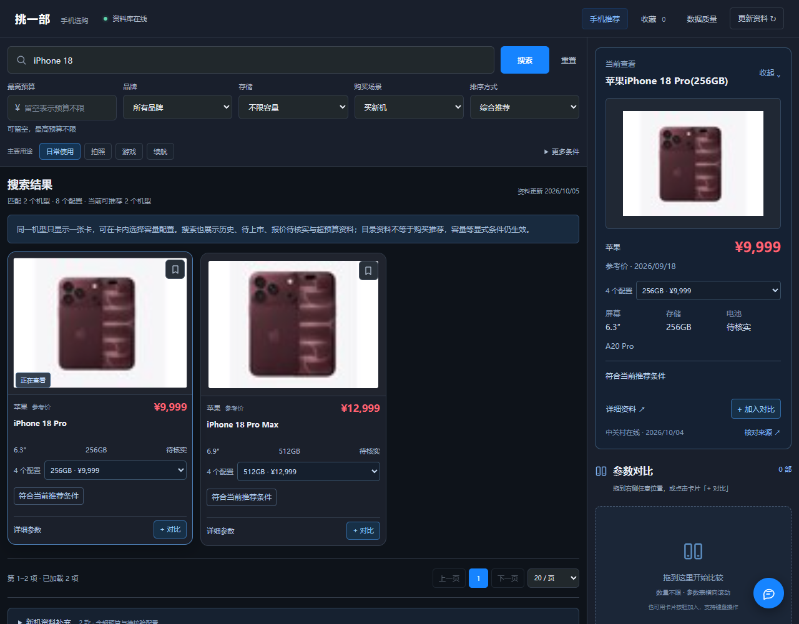

<p align="center">
  <a href="https://zhong-ze-wei.github.io/phone_show/">
    <picture>
      <source media="(prefers-color-scheme: dark)" srcset="https://zhong-ze-wei.github.io/phone_show/assets/banner-dark.svg">
      
    </picture>
  </a>
</p>

<h1 align="center">挑一部 · 手机选购工作台</h1>

<p align="center">按自己的需求找手机，预算可以稍后再定。</p>

<p align="center">
  <a href="https://zhong-ze-wei.github.io/phone_show/">在线演示</a> ·
  <a href="#直接运行">运行</a> ·
  <a href="#如何快速选">选机</a> ·
  <a href="#更新与自动清洗">数据清洗</a> ·
  <a href="#数据与文档说明">文档</a>
</p>

<p align="center">
  <a href="https://github.com/Zhong-Ze-Wei/phone_show/actions/workflows/pages.yml">
    
  </a>
</p>

这是使用 **Python + uv、SQLite、FastAPI、React** 的本地选购工作台。筛选与对比无需模型；采集品牌官网与 ZOL 的公开资料，自动清洗并保留字段来源。预算可选、默认容量不限；主页面按明确条件筛选，可按上市时间或价格排序，不计算推荐分。型号搜索显示完整已存目录，历史、待核价和待上市资料都会标清状态。

在线介绍页含真实界面截图、动效和可操作的可选预算／价格排序、多机对比、顾问录制演示，手机上也能打开。演示使用 2026-10-04 的真实数据快照，不调用模型；完整筛选与连续聊天需启动本地工作台。[展示页源码](site/)与[发布维护说明](docs/PRODUCT_SITE.md)均随项目保存，修改 `site/` 并合并到 `master` 后由 GitHub Actions 自动发布，不再维护独立演示项目。

## 看大图，按自己的需求挑

直接搜索型号或设置品牌、系统、容量等条件：看大图和规格，收藏、拖拽对比，再让 **DeepSeek-V4.1-Flash** 解释取舍。价格范围默认不限，需要控价时选择金额档位或自定义上限。收藏放在图库内的「我的收藏」，详细参数按需打开，右侧不再重复预览。点击截图，可以先在浏览器体验静态选机演示。

电脑窗口收窄时，图库按实际可用宽度调整为两列或三列，右侧接收拖入的手机并提供对比；展开顾问后仍能浏览和拖拽手机。较窄的聊天图库使用横排图卡，避免一张大图占满列表。布局规则和实测截图见 [窄窗口布局说明](docs/UI_RESTORE.md#窄电脑窗口的图库密度2026-10-04)。

[](https://zhong-ze-wei.github.io/phone_show/#demo)

### 放在一起比较，让顾问说清取舍

整个右栏都能接收拖拽，可连续加入多台手机，参数表横向滚动查看，不必瞄准右下角。机器人球可以自由拖动，也能接收手机；点击或拖入手机后，顾问向左展开，拖动边界上的红色叉按钮可以调整左右宽度。收起后保留已选手机和聊天，左侧始终可以浏览；五种角色帮助你从不同角度讨论需求。点击截图查看[顾问的事实、来源与会话规则](docs/AI_CHAT.md)。

[](docs/AI_CHAT.md)

### 手机端，双列图卡快速浏览

手机端使用双列图卡和底部操作条，继续浏览、对比与打开顾问。点击截图查看在线演示；完整功能在本地工作台使用。

<p align="center">
  <a href="https://zhong-ze-wei.github.io/phone_show/#demo">
    
  </a>
</p>

## 直接运行

需要 Git、[uv](https://docs.astral.sh/uv/) 和 Node.js 22.12 或更新版本。首次从 [GitHub 仓库](https://github.com/Zhong-Ze-Wei/phone_show) 克隆，在 PowerShell 执行：

```powershell
git clone https://github.com/Zhong-Ze-Wei/phone_show.git
Set-Location phone_show
uv run python scripts/restore_snapshot.py
.\start.ps1
```

先还原版本数据，再启动页面。已有项目直接运行 `.\start.ps1`；还原脚本检测到已有数据库会保留它，不覆盖。uv 管理 Python 与依赖，启动脚本再安装前端依赖、构建页面并启动服务。浏览器打开 [http://127.0.0.1:8501](http://127.0.0.1:8501)。终端按 `Ctrl+C` 停止。

<details>
<summary>分步启动、其他入口与端口设置</summary>

也可以分步运行：

```powershell
uv sync --link-mode copy
npm --prefix frontend ci
npm --prefix frontend run build
uv run phone-finder
```

`uv run python app.py` 同样启动新版。端口占用时用 `uv run phone-finder --port 8502`。Python 由 uv 管理，依赖由 `uv.lock` 固定；前端依赖由 `frontend/package-lock.json` 固定。

</details>

仓库包含约 12 MB 的 [压缩数据库快照](data/snapshots/phones.sqlite3.gz)，保存本版 **4,429 条机型配置、5,793 条原始记录快照和 795 条主图修复记录**。还原前校验压缩文件 SHA-256；[清单](data/snapshots/manifest.json)记录版本与校验摘要。运行数据库、外部 HTML 缓存和采集检查点不随 Git 提交。如果未还原且数据库为空，启动会导入随项目保留的 Excel 历史资料。

**版本快照保留原采集和报价核验时间，不会因还原而变新。** 主筛选默认检查近期资料和已上市证据；空预算可查看待核价机型，设置金额约束时还需要独立近期报价。过期或缺价时可点击“更新资料”，或在另一终端执行 `uv run phone-assistant sync --latest` 获取近期机型资料。日常定期执行 `uv run phone-assistant sync` 刷新完整目录与已知报价。

AI 顾问需另外配置自己的密钥，见 [DeepSeek 配置](#deepseek-配置)。不配置密钥也能采集、筛选、收藏与对比。

<details>
<summary>并行打开历史恢复版与 2025 原界面截图</summary>

当前版继续运行在 8501，另一个终端执行：

```powershell
uv run --no-sync python scripts/run_historical_preview.py
```

[可运行恢复版](http://127.0.0.1:8502/)是 **2026-10-04** 提交 `958741d`，保留当时的界面与必填预算逻辑；它读取当前数据库的独立副本，不覆盖当前版。[2025 原版截图对照](http://127.0.0.1:8502/history/)来自真实历史提交，原 Flask 子仓库源码尚未找回，不能把恢复版称作原版。数据兼容范围、依赖及停止方式见 [历史对照说明](docs/HISTORICAL_PREVIEW.md)。

</details>

## 如何快速选

1. 直接搜索型号；最高预算可以不填。按需限制品牌、系统、容量，按上市时间或参考价格排序。
2. 看大图与规格，切换同型号的真实容量配置。把候选放进右侧对比，数量不局限三台，也可收藏。
3. 需要分析时打开右侧顾问，表达用途、选择角色并明确发送。打开面板不会调用模型，顾问用途也不会重排图库。

主页面是**筛选工具**，不计算综合推荐分、匹配分或品牌加分。价格与参数保留来源，未知值如实显示。现行规则见 [筛选策略](docs/RECOMMENDATION_STRATEGY.md)。

<details>
<summary>配置选择、资料状态、新机发现与二手说明</summary>

首次打开预算为空、容量不限。空预算下可以浏览已有上市证据的近期在售资料，未知或旧报价显示待核价；主动填写金额后，只有有独立近期已核价的配置才能通过金额筛选。完整型号搜索和新机资料仍可查阅历史、待上市、超预算和待核价型号，各自说明状态，不能据此确认当下库存。

图库按来源上市时间、价格升序或价格降序排列，默认上市时间。所有符合条件的型号可浏览，不只截取评分前 60 台。排序不是质量榜或测评结论，用途也不参与隐藏加权。

点击图片按需打开详细规格和来源；用「+ 对比」或拖到右栏任意位置加入多款，横向查看全部参数与来源，收藏留待后续购买。比较和明确咨询不会只截取前三台。

不同容量配置合在同一张型号卡内，可以直接切换版本、查看各自参考价并加入对比。详情、收藏、拖拽和顾问使用选中的真实版本，已加入比较的旧版本继续保留。官网通用规格与具体配置报价分别保留来源；iPhone 18 Pro 与 Pro Max 各有四种可选容量，两张型号卡共覆盖八种配置。修复依据见 [配置合并与参数说明](docs/SEARCH_AND_COMPARE.md#配置合并与苹果参数修复2026-10-05)。

[](docs/SEARCH_AND_COMPARE.md#配置合并与苹果参数修复2026-10-05)

点击 AI 球打开顾问，选择科技达人、生活顾问、性价比专家、商务精英或游戏玩家，说明日常、游戏、拍照、续航等用途，再明确发送。只有发送时使用 AIPing 额度。预算与主筛选一致，不因聊天文字擅自修改；保存／加载只处理本浏览器会话，不恢复旧预算与筛选，也不把旧报价当当前价格。顾问事实与来源规则见 [AI 顾问](docs/AI_CHAT.md)。

“考虑二手”仅提供机型参考，不改成二手价，也不自动启用历史资料。现有来源没有二手行情、成色、电池健康或保修证据；实际购买前仍需核对卖家报价、版本与设备状态。

</details>

<details>
<summary>在命令行按预算与型号筛选</summary>

命令行使用同一筛选逻辑；旧 `recommend` 命令名保留兼容，不计算用途分：

```powershell
uv run phone-assistant recommend --budget 4000 --sort price_asc
uv run phone-assistant recommend --query iPhone
uv run phone-assistant recommend --budget 6000 --brand 小米 --storage 512
uv run phone-assistant recommend --budget 3000 --history --query vivo
uv run phone-assistant recommend --budget 6000 --query X500 --sort newest
uv run phone-assistant recommend --budget 5000 --purchase-mode used
```

</details>

## 更新与自动清洗

采集完成后自动清洗、校验并保留字段来源；缺失参数留空，冲突与失败保留证据。先更新公开资料，再查看质量结果：

```powershell
uv run phone-assistant sync
uv run phone-assistant quality
```

字段语义、单位转换、去重和异常处理见 [清洗策略](docs/CLEANING_STRATEGY.md)，采集与恢复见 [采集流程](docs/DATA_PIPELINE.md)。

<details>
<summary>完整同步命令、失败恢复与重新清洗</summary>

```powershell
# 发现已配置的公开列表、容量版本并抓详情；自动清洗和发布
uv run phone-assistant sync

# 开始新的刷新批次
uv run phone-assistant sync --force

# 仅核对官网及品牌新品入口，补齐对应版本；不刷新已有历史目录
uv run phone-assistant sync --latest

# 接续上次未完成批次，保留其已抓取快照的真实时间
uv run phone-assistant sync --resume

# 小批验证，报告会说明覆盖受限
uv run phone-assistant sync --force --limit 10

# 查看覆盖率、缺失和异常
uv run phone-assistant quality

# 清洗策略升级后，用原始快照重新计算，不重新访问网页
uv run phone-assistant clean

# 重新导入旧 Excel；始终标记为历史，不覆盖新鲜来源数据
uv run phone-assistant import-legacy
```

正常同步带请求间隔、有限重试和可恢复检查点；无效响应、验证页面或缺少参数的页面进入失败报告。不会删除整个旧数据库，也不会为了补齐字段而生成参数。普通 `sync` 或 `--force` 获取新快照，`--resume` 接续未完成批次。部分完成退出码为 2，完整完成为 0，执行错误为 1。

</details>

图片解析优先使用实际产品主图，避免系列小缩略图覆盖大图。已有缓存可用 `uv run python -m phone_assistant.images --apply --report data/reports/image_replay.json` 离线补图；只修改图片及来源，原报价时间不变，重清洗后保留。先省略 `--apply` 可预览改动。完整依据见 [图片采集与修复](docs/IMAGE_PIPELINE.md)。

## DeepSeek 配置

筛选、收藏与对比无需模型密钥。需要真实顾问聊天时，再配置自己的 AIPing 密钥；只有明确发送时才调用模型。

<details>
<summary>配置 DeepSeek、检查 API 与常见错误</summary>

首次使用 AI 顾问时，复制 `.env.example` 为 `.env`，填入自己的 AIPing 密钥；已有 `.env` 时直接编辑它：

```powershell
Copy-Item .env.example .env
```

```dotenv
AIPING_API_KEY=your-api-key
AIPING_BASE_URL=https://aiping.cn/api/v1
AIPING_MODEL=DeepSeek-V4.1-Flash
AIPING_TIMEOUT=120
```

修改配置后重启服务。环境变量优先于 `.env`；密钥只由 Python 读取，不进入浏览器或日志，`.env` 已被 Git 忽略。请求遵循 [AIPing 文本模型文档](https://aiping.cn/docs/API/text-models)，使用 OpenAI 兼容 SDK 和平台模型 ID，默认关闭思考模式。

```powershell
uv run phone-assistant check-api
uv run phone-assistant status
```

`check-api` 获取模型列表并发送一次真实短请求。常见错误：401 检查密钥，402 检查余额，404/422 检查模型和路由，429 等待后再试。模型不可用时，本地筛选和比较仍可使用。

</details>

## 数据与文件

<details>
<summary>模块职责、数据目录与本地 API 入口</summary>

| 路径 | 用途 |
| --- | --- |
| `frontend/` | React 页面、前端测试与构建配置 |
| [`site/`](site/) | 独立静态产品介绍页、真实截图与交互演示，发布至 GitHub Pages |
| `phone_assistant/server.py` | 本地 API 与页面服务 |
| `phone_assistant/crawler.py` | 列表、型号和参数页面解析 |
| `phone_assistant/pipeline.py` | 自动采集、检查点、失败与覆盖报告 |
| `phone_assistant/cleaning.py` | 字段语义、单位、否定语句与异常校验 |
| `phone_assistant/storage.py` | SQLite 原始快照、规范记录与字段来源 |
| `phone_assistant/recommendation.py` | 明确条件筛选、型号归组与客观排序 |
| `phone_assistant/advisor.py` | 只基于候选证据的 DeepSeek 解释 |
| `phone_assistant/chat.py` | 每轮重读规范事实、有界历史与真实 SSE 导购聊天 |
| [`data/snapshots/phones.sqlite3.gz`](data/snapshots/phones.sqlite3.gz) | 可还原的版本数据库，保留规范记录、原始记录及主图修复 |
| [`data/snapshots/manifest.json`](data/snapshots/manifest.json) | 快照计数、创建时间、大小与 SHA-256 校验摘要 |
| [`scripts/restore_snapshot.py`](scripts/restore_snapshot.py) | 首次克隆后校验并还原；已有数据库不覆盖 |
| `data/phones.sqlite3` | 当前本地数据；与原 Excel 分开 |
| `data/raw/zol-sync-*/` | 每次采集的快照和检查点 |
| `data/reports/latest_sync.json` | 最近同步的实际覆盖与失败报告 |
| `data/recovered/` | Git 历史恢复的原始 Excel，保持不变 |

规范记录可通过 `/api/phones/{id}` 查看，筛选通过 `/api/filter` 查询，对比通过 `/api/compare` 按所选 ID 读取规范资料与当前条件提示，质量信息通过 `/api/quality` 查看，API 说明位于 [http://127.0.0.1:8501/docs](http://127.0.0.1:8501/docs)。

</details>

## 开发与验证

<details>
<summary>构建、测试、开发启动与验收结果</summary>

```powershell
uv run pytest -q
npm --prefix frontend test
npm --prefix frontend run build
uv build
```

根目录也提供 `npm test`（前端与 Python 测试）及 `npm run build`（前端构建），用于统一验证。

2026-10-04 验收：**304 项 Python 测试、28 项前端测试、58 项浏览器检查通过**，并单独验证了 2 次真实 AIPing 流式请求。新增快照还原检查覆盖完整性、不覆盖已有库及失败后清理。构建、当前数据数量、覆盖缺口与详细结果见 [交付验证记录](docs/VALIDATION.md)。

开发前端时一个终端运行 `uv run phone-finder --port 8502`，另一个终端运行 `npm --prefix frontend run dev`，开发服务器会代理 `/api`。

测试使用本地页面片段和模拟模型，不消费 API 额度。构建产物只包含 Python 包；运行网页仍需完整项目中的前端产物和数据文件。

</details>

## 数据与文档说明

原 Excel 的 **4,018 条配置记录** 作为历史资料保留；新采集与历史字段分别标注来源。没有证据的参数留空。新品发现、详细参数与容量版本受目标源和实际访问结果限制，**不声称已收齐全市场手机**；本地 `data/reports/latest_sync.json` 才是本次覆盖与失败项的依据。

| 文档 | 内容 |
| --- | --- |
| [清洗策略](docs/CLEANING_STRATEGY.md) | 字段语义、单位转换、去重、异常与缺失处理 |
| [采集流程](docs/DATA_PIPELINE.md) | 来源发现、自动清洗、检查点与失败恢复 |
| [官方来源覆盖](docs/SOURCE_COVERAGE.md) · [新品问题核查](docs/NEW_PHONE_AUDIT.md) | 官网身份核对、起售价边界与仍待采集的机型 |
| [筛选策略](docs/RECOMMENDATION_STRATEGY.md) | 明确条件、可选预算、客观排序与独立 AI 分析 |
| [AI 顾问](docs/AI_CHAT.md) | 五角色、真实流式聊天、来源与本地保存规则 |
| [图片流程](docs/IMAGE_PIPELINE.md) · [界面恢复](docs/UI_RESTORE.md) | 主图修复、原版截图依据与当前交互验收 |
| [产品介绍页](docs/PRODUCT_SITE.md) | 在线演示入口、快照与录制边界、GitHub Pages 发布维护 |
| [README 版式](docs/README_DESIGN.md) | 封面、真实截图、链接与折叠内容的维护规则 |
| [架构](docs/ARCHITECTURE.md) · [交付验证](docs/VALIDATION.md) | 模块职责、数据结果与测试证据 |

## 保留的历史资料与财报脚本

<details>
<summary>历史资料检索、财报工具与恢复记录</summary>

旧 Markdown、Excel、数据文件与财报脚本仍保留。`uv run phone-assistant search "问题"` 和 `uv run phone-assistant ask "问题"` 用于历史技术资料检索，不能当作新版当前推荐结果。

`get_data/simple_get_data.py`、`get_data/get_data.py` 是遗留财报工具，已迁移同一套 AIPing 配置。增强财报工具需要 `uv sync --extra crawler` 与 `uv run playwright install chromium`；它们不参与新版手机 HTTP 采集。

原项目恢复过程见 [恢复记录](docs/RECOVERY.md)，旧爬虫缺陷和旧数据年份证据见 [此前审计](docs/CRAWLER_AUDIT.md)。历史文档不能替代新版流程说明。

</details>
