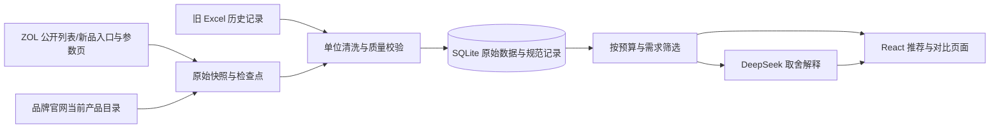

# 挑一部：实现与推荐规则

## 为什么采用这个结构

当前目标是个人快速选手机、可以在 Windows 本地运行、定期更新公开参数。采用 Python 采集与清洗、SQLite 存储、FastAPI 服务、React 页面。SQLite 不需要额外启动 MySQL，原始数据和发布数据可以在同一事务中保存。前端筛选不依赖模型服务；DeepSeek 只解释已存在的候选和取舍。

采集、清洗和推荐分别对应 `crawler.py / pipeline.py`、`cleaning.py / storage.py`、`recommendation.py`。旧 Markdown 与财报工具保留，但不会混入新版手机推荐的实时事实来源。

## 推荐如何产生

1. 页面首次预算留空，用户主动设定金额后才调用预算推荐；API 与命令行入口同样要求明确预算。预算推荐默认只选来源目录状态为 `listed`、最近 30 天抓取的记录；官网与 ZOL 均可成为有效来源。上市年龄只参与加分，不作为默认淘汰旧款的条件。未知日期保留并显示待核实；明确未来日期或仅公布但未上市的条目不参与已上市推荐。可主动启用历史资料。`listed` 表示来源列表状态，不保证每个渠道有库存；刷新时间不会让 2021 年上市的手机变成新机。
2. 预算、品牌、系统、存储容量与搜索词是明确的筛选条件。价格未知的记录不会当作零元通过预算筛选；默认还排除仅有历史价、采集时间未知或超过30天的价格。界面覆盖信息会告知未核价数量，启用历史可参考旧报价。
3. 每个用途根据已知标称规格计算 0–100 匹配分。用户选中的用途权重为 3，其余用途权重为 1。没有依据的维度不估算，同时对信息覆盖不全的记录降低总分。
4. 默认 `recommended` 综合排序：用途匹配 75%、预算余量 10%、上市时效 10%、主流品牌偏好 5%。`score` 保持规格用途分，`recommendation_score` 独立表示综合分，`ranking_breakdown / ranking_reasons` 保留分项与解释。可切换“新机优先”“需求匹配”“价格由低到高”“价格由高到低”。上市年、月、日只使用来源确实提供的精度；抓取时间与产品 ID 不用于推断上市新旧。同一机型不同容量只占一个位置，在当前排序下选择预算内的合适版本；前 60 个位置在排序后截取。
5. 对比通过 `/api/compare` 重新读取所选 ID 的最新记录，并按当前偏好重新计算，避免先后加入的手机沿用不同口径的旧分数。超出当前预算的手动对比项会显示提示。排序后才调用模型解释；模型不能增加候选、修改数据库、补造参数或改写规则分数。

| 需求 | 使用的依据 | 不代表什么 |
| --- | --- | --- |
| 日常 | 内存、存储、电池容量 | 系统稳定性实测或多年使用体验 |
| 游戏 | 已识别芯片系列档位、内存、刷新率 | 跑分、持续帧率或散热测试 |
| 拍照 | 原文明确支持的光学防抖与长焦配置 | 成片画质排名；不按像素高低直接排优劣 |
| 续航 | 标称电池容量、充电功率 | 实测续航时间或充满所需分钟数 |
| 轻巧偏好 | 屏幕尺寸、重量 | 实际握持感受 |

数值规格采用有上限的线性归一化：电池 3500–7500mAh、充电 15–100W、内存 4–16GB、屏幕刷新率 60–144Hz。日常维度存储采用 64–512GB、内存 4–12GB、电池 3500–6500mAh。超过上限不会继续获得额外加分。

拍照配置：有影像原文字段时基础 0.35，明确光学防抖加 0.30，明确长焦加 0.35；否定语句不加分。它用于配置偏好匹配，不能当作真实影像水平。芯片系列档位只识别源码显式列出的骁龙、天玑、苹果系列；未识别的新芯片显示待核实，避免凭型号猜测性能。

缺少部分用途指标时，对剩余已知用途加权平均，再乘以 `0.75 + 0.25 × 已知用途占比`。轻巧偏好开启时，规格匹配占 70%，屏幕和重量匹配占 30%。选择“需求匹配”时按用途分、价格、稳定产品 ID 排列；“新机优先”先比较真实上市年/月/日，再比较用途分与价格。“综合推荐”使用明确的综合权重并允许较老但更适合、价格更好的机型排前。分数只在这一套规则下可比较，并非测评结果。中国市场的“今天”使用 UTC+08，避免 UTC 日期把本地当天的新机误判为未来；抓取时效仍按 UTC 时间差计算。

主流品牌是采购策略中的固定名单，不是质量或实测排名，最多贡献 5 分。上市日期未知不获得近期加分；只知年月或年份时，以来源日期区间的最早端保守判断，不保存虚构日期。二手机型参考模式取消年龄加分，将用途权重提高到 85%，不自动放行旧报价，也不将新机参考价当二手价。完整公式与边界见 [推荐策略](RECOMMENDATION_STRATEGY.md)。

## 新机发现与预算推荐为什么分开

`/api/recommend` 的 `phones` 只包含通过全部筛选条件的预算推荐；`discovery` 单独返回来源当前入口中发现的机型。`new_from_source`、`new_release_catalog_url` 表示官网当前目录或 ZOL 新品模块的来源身份，不保证机型今年发布，更不会将抓取日期当上市日期。

发现区保留配置价格未核实、容量未知、超预算与尚未上市的条目，逐项给出 `discovery_reasons / discovery_codes`。官网“起价”保存在 `price_from`，没有 SKU 对应报价时 `price` 仍为空，不能用起价伪装选定配置价格。查看详情可访问实际官网或源站；未来日期明确标待上市。

发现结果按品牌与搜索词筛选，独立于预算和容量硬筛选；API 不做全局 12 条截断。前端品牌概览优先展示 vivo、OPPO、华为、荣耀、苹果的各一个代表，再补其他品牌；过滤后不存在的品牌不补造。点击“查看全部”后仍按来源实际上市日期展示全部机型。未知系统的发现条目保留为待核验；已知系统不符时按用户系统偏好排除。预算推荐的 `coverage.excluded` 则按机型系列说明超预算、未核价、容量不符、旧资料和未来日期等原因；`budget_suggestion` 只来自除预算外满足条件的已核价候选，按钮由用户主动放宽预算，系统不会自动把高价新机混入低预算结果。

同一系列的发现卡优先选择满足当前条件且有近期已核报价的配置，避免官网无报价的通用型号遮住已有报价的合格配置；若全部超预算，则优先选择容量符合要求、已知近期价格最低的配置，再保留待核价资料。例如预算 6000 元时，256GB 配置 5499 元会优先于同系列 1TB 配置 6999 元。

推荐和发现的列表记录只发送卡片需要的规格、解释和来源；`field_sources` 仅保留报价来源，避免每次筛选都重复运送全部原文与逐字段来源。详情 `/api/phones/{id}`、对比 `/api/compare` 仍返回完整资料。实际 60 个预算候选和 105 个发现系列的 JSON 由约 3.7MB 降至约 326KB，没有删掉数据库里的原始字段。

## 数据新鲜度与来源

每条记录保留 `origin / source_url / fetched_at`；每个合并字段另有 `field_sources`。新抓取缺失的字段可以保留历史值，但其来源和时间继续标为历史，不能借新记录时间冒充新价格。旧 Excel 没有逐条抓取时间，规范记录不会伪造这个时间。

价格是来源站参考报价。当前网页、历史导出、型号发售价和实际电商成交价需要区别看待；本项目不把 ZOL 报价当作实时渠道最低价。清洗、冲突、异常值和失败队列的详细处理见 [清洗策略](CLEANING_STRATEGY.md) 与 [采集流程](DATA_PIPELINE.md)。

## 本地运行与边界

Web 服务只监听 `127.0.0.1`。React 编译产物和 API 使用同一个端口，密钥仅在 Python 读取 `.env`，不会返回给浏览器。采集在后台执行，浏览和筛选仍然可用。采集失败保留旧数据及失败报告；普通同步创建新快照，使用 `sync --resume` 从检查点恢复。

选择这套轻量结构是为了能够直接运行和维护。若未来要多人协作或提供公网服务，需要在那时增加登录、任务队列与服务部署配置。
