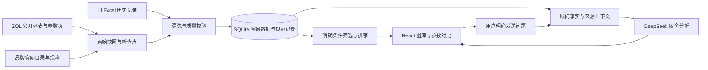

# 挑一部：实现与筛选规则

现行交互规则更新日期：2026-10-06。

## 结构与职责

个人工作台需要在 Windows 本地运行、更新公开资料、按条件找手机并比较。Python 负责采集与清洗，SQLite 保存原始快照和规范记录，FastAPI 提供数据与页面，React 管理筛选、预览、配置和对比。筛选不依赖模型，DeepSeek 只在用户明确发送问题时分析已有资料。

采集对应 `crawler.py / pipeline.py / official_sources.py`，清洗与存储对应 `cleaning.py / storage.py`，筛选在保留历史文件名的 `recommendation.py` 中实现。旧 Markdown 与财报工具不参与当前手机事实筛选。

## 主页面筛选

`POST /api/filter` 接收预算、品牌、系统、容量、搜索词、资料范围与排序；旧 `/api/recommend` 兼容到同一个引擎。预算与容量默认不限，不填预算也能浏览。默认浏览近期已有上市证据的在售资料，未知或旧报价如实标记；金额有上限或下限时需要该配置独立、近期核验的报价，不能以零元或官网起价通过。浏览资格与购买资格分别说明。

图库不再计算用途分、综合分、品牌偏好分或新机加分，符合条件的家族不截断为评分前 60。只允许上市时间、价格升序、价格降序三种排序，默认上市时间；具体定义见 [筛选策略](RECOMMENDATION_STRATEGY.md)。用途只在右侧顾问中表达，不参与图库筛选或隐藏重排。

一个 `family_key` 一张型号卡，默认选当前条件内最低已知参考价的具体配置；卡内可以切换其他真实配置。`GET /api/phones/{id}/variants` 读取全部配置及当前条件说明，`GET /api/phones/{id}` 返回完整所选记录，`POST /api/compare` 重读全部所选 ID 的资料。详情、收藏、拖拽和顾问使用所选真实 ID；加入对比的旧配置保持不变，不限制三台。

## 目录与新机资料

完整型号目录保留历史、待上市、过期或缺价记录，显示不符合当前条件的原因，帮助用户查资料。当前官网目录或 ZOL 新品入口的身份不等于今年发布，也不能证明库存。

独立资料发现仍允许查看超预算、未核价和容量未知的机型。`new_from_source / new_release_catalog_url` 保留来源身份；官网“起价”保存在 `price_from`，没有具体 SKU 报价时 `price` 保持未知。发现与目录状态不能替代主筛选证据。

列表只发送卡片需要的规格、条件状态和来源，完整参数及逐字段证据在详情、配置与比较入口读取。列表精简不删除数据库中的原始参数。

## 数据和时间

记录保留 `origin / source_url / fetched_at`，逐字段保留 `field_sources`。参数、价格与图片各有来源和时间；新快照可以保留历史字段，但不能把旧字段核验时间改成新抓取时间。旧 Excel 没有逐条采集时间，不补造。

同型号官网明确的通用参数可补到具体配置，并保留原值与冲突。价格、RAM、存储、电池 mAh 和手机充电功率不跨配置共享。参考报价、上市发售价、历史价与成交价分别说明。清洗与异常策略见 [清洗规则](CLEANING_STRATEGY.md)，可恢复采集见 [数据流程](DATA_PIPELINE.md)。

## 顾问与本地运行

顾问每次发送重读规范事实和完整来源。用户明确选中的机型全部保留，无手动选机时取当前筛选资料中的前三台控制上下文；这不是评分榜。AI 不能修改数据库或暗改主筛选条件。具体生命周期、录制与会话规则见 [AI 顾问](AI_CHAT.md)。

服务默认只监听 `127.0.0.1`，React 产物与 API 同端口，密钥仅后端读取 `.env`。采集在后台执行；部分失败保留旧资料、实际状态与错误报告。同步可通过 `sync --resume` 接续，不把部分完成显示为收齐全市场手机。

当前结构无需额外启动数据库服务。只有确实要支持多人和公网运行时，才增加登录、任务队列及部署配置。
