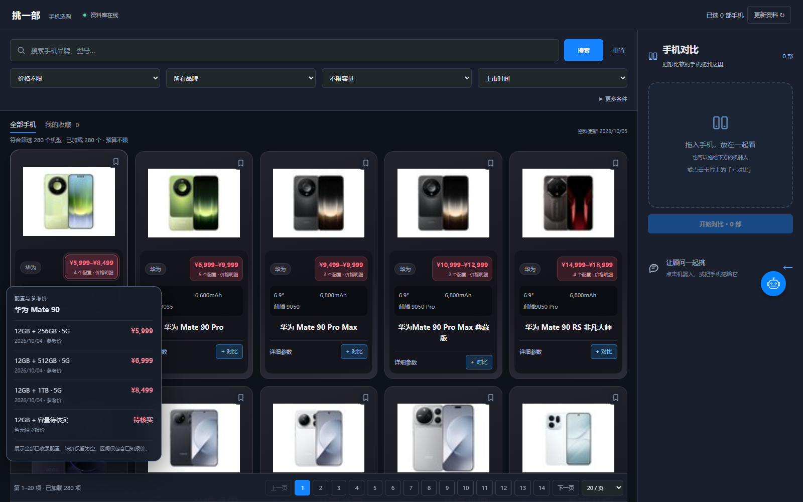

# 价格概览与页面加载（2026-10-06）

## 价格如何展示

主图库和新机发现的卡片取消配置下拉切换，直接展示全部已收录配置的已知报价区间。例如 256GB 为 5999 元、512GB 为 6999 元、1TB 为 8499 元，卡片显示 `¥5,999–¥8,499`；相同价格只显示一个金额。

鼠标悬停或键盘聚焦价格，显示小浮窗；触屏轻点价格展开，点外部关闭。浮窗列出内存、容量、网络版本、对应价格和报价日期；历史价、无报价日期、超出预算会明确说明。没有价格的配置仍占一行，不用官网起价填补，也不假装属于最低价。区间包含所有已收录配置的已知价格，可能含历史报价，不能当作实时成交价。

浮窗数据直接来自列表的 `variant_summary`，不请求 `/variants`。所有行都可查看，长列表在浮窗内滚动；采用淡入和轻微位移动效，系统减少动画设置下禁用。右侧拖拽和顾问继续使用卡片代表配置的真实 ID；需要某一版本的参数和比较时，仍可在详情中明确选择。

## 慢在哪里，做了什么

优化前，每次 `/api/filter` 都从 SQLite 读取 4429 条配置、重复补全官网公共参数、重新筛选并编码整个响应；`/api/meta` 还会重复读整库。列表响应约 1.90 MB。首屏此外固定等待 250ms 才发出请求。

现在分为两层服务端缓存：

1. `CatalogueSnapshot` 只保留一份只读的合并资料快照，多个筛选条件共用；数据库版本变化后重新读取。元信息统计复用该快照，不额外读整库。
2. `CatalogueResponseCache` 缓存已经编码的公开 JSON 响应，命中时直接返回，省去反复计算和 FastAPI 递归编码。最多 32 项、32 MiB；LRU 淘汰，超过容量的单次响应不存入。有效期 60 秒，以便重新判断报价时效和上市状态。缓存锁避免同时进入的相同冷请求重复计算。
3. 开启 GZip 压缩；实际传输约 149 KB，较原 JSON 减少约 92%。HTML 与 API 不在浏览器长期保存，避免旧资料伪装成最新结果。AI 会话不缓存，SSE 不压缩。
4. 首次进入和非文字条件变更立即发请求；输入搜索词仍保留 250ms 防抖。

失效依据是 SQLite 主文件和 `-wal` 文件的 inode、大小、纳秒修改时间。网页同步、独立命令行同步、外部 WAL 写入都会使结果和快照在下一次读取时失效；构建期间发生数据库变化的结果不会写入缓存。缓存是进程内的，服务重启后需重新建立。测试覆盖外部 WAL 更新、过期、容量上限、并发首次读取及跨筛选条件不修改共享快照。

当前单进程服务用进程内缓存即可共享结果，不需要额外部署 Redis。若未来改为多进程、多机器部署，再考虑统一缓存；浏览器始终通过 HTTP 访问应用 API。

## 实测与边界

Windows 本地环境、同一份 4429 配置数据库，使用 `httpx` 连续请求默认筛选：

| 指标 | 优化前 | 优化后 |
| --- | --- | --- |
| 重复筛选请求 | 1.00–1.20 秒 | 缓存命中 26–50ms |
| 响应传输体积 | 约 1.90 MB | 约 149 KB |
| 再次打开到首批卡片出现 | 未独立留基线 | 实测约 0.15–0.17 秒 |

这些是本机样本，不是保证。服务重启后的首次读取、未缓存的筛选、缓存过期时仍需计算；在同时运行测试的浏览器验收中首次卡片出现约 1.6–1.8 秒。手机图片来自外部图片源，卡片出现时间不等于全部图片下载完成。

构建、50 项前端测试和 371 项 Python 测试通过。浏览器实际验收覆盖全部配置同时展示、悬停无新增请求、键盘打开／Escape 关闭、760px 和 390px 浮窗边界、无整页横向溢出。未调用付费模型。
