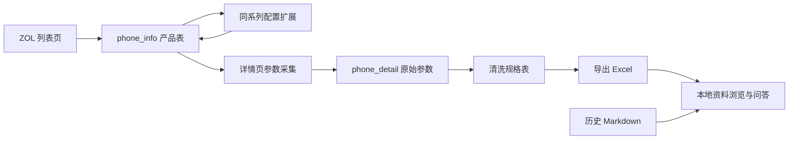

# 手机爬虫与数据新鲜度审计

审计日期：2026-10-03（Asia/Hong_Kong）。范围是相邻 `Get_Phone` 的原采集、清洗、导出代码，以及当前页面使用的 Excel / Markdown。检查以源码和本地文件为主，辅以少量只读源站请求；没有运行采集入口、连接或修改数据库，也没有更换页面数据。

## 结论

当前数据适合历史规格查询，面向当前选购需要重新采集并建立更新链路。

当前网页读取的是从 Git 历史恢复的 2025 年 Excel 和历史 Markdown，没有调用手机爬虫或同步新导出。换成 DeepSeek-V4.1-Flash 改善了模型接入，不能刷新这些本地资料。

原爬虫仍有可用的列表、详情提取基础，但存在明确的扩展崩溃、已有详情不刷新、覆盖不足、失败误报成功和清洗错误。需要修复更新逻辑后再补采，不能把运行结束的“成功”提示当作数据已更新。

## 数据到底多旧

Excel：`data/recovered/phone_specs_export_中文表头.xlsx`。共 4,018 条配置记录、60 字段、94 个原始品牌名称。记录数不等于独立机型数；容量配置会产生不同产品 ID。

| 发布年份 | 配置记录数 | 原始型号字符串去重数 |
| --- | ---: | ---: |
| 2011–2022 | 2,274 | — |
| 2023 | 660 | 289 |
| 2024 | 616 | 233 |
| 2025 | 290 | 93 |
| 2026 | 0 | 0 |
| 年份缺失 | 178 | — |

- 2024 年以前发布的记录占 73.02%；2024–2025 年合计 906 行、326 个原始型号字符串。
- 最晚的已填写 `完整发布日期` 为 **2025-08-07**，iQOO Z10 Turbo+ 的四个配置，见 Excel `B4016:B4019` / `F4016:F4019`。距审计日期已有 422 天。
- 2025 年 7–8 月仅有 31 条配置、10 个原始型号字符串。
- Excel 文件属性的创建、修改时间是 **2025-10-08 UTC**，表示文件导出时间。不能由此推断每条数据都是当天抓取。
- 表中没有逐条采集时间、更新时间或来源 URL，参考价格的新鲜度无法判断。

62 份技术 Markdown 中，21 份有明确 2025 年时间标记，16 份标 2024 年，25 份没有明确更新时间。最新的 `生成时间` 2025-11-03 出现在旧 JSON 转换出的完整数据库文档中，生成时间不等于重新采集。11 份文档提到 2026 年，主要是预测内容。

历史冲突示例：华为报告第 252 行写 Pura80 系列预计 2026 年发布，Excel 已记录 Pura80 Ultra 于 2025-06-26 发布；小米报告第 17 行写小米 15 Ultra 在 2024 年底发布，Excel `E3735/F3735` 记为 2025 / 2025-03-03。审计确认资料之间冲突，没有据此替任一历史来源背书。

## 实际数据流程

原 `Get_Phone` 实际抓取的是中关村在线 ZOL。`choise_phone` 的归档文档还描述了 GSMArena、DXOMARK 等资料来源，两者不能视为同一个已实现的自动更新系统。



当前页面读取的是历史导出文件。原数据库、导出任务和当前页面之间还没有持续同步实现。`app.py:15/20` 缓存本地资料；`assistant.py:61/63` 检索 Markdown 并附加 Excel 行，没有源站刷新请求。

## 采集代码的明确问题

以下代码路径均相对于 `E:\ZZ's_Code\ZZ's_PY\Get_Phone`。

### 1. 配置扩展会直接失败

`crawler_system/core/get_json_data/expand_phone_config.py:73`：

```python
inserted_count, updated_count = 0
```

这会触发 `TypeError: cannot unpack non-iterable int object`。已隔离执行该 AST 赋值复现，不需要联网或数据库。成功取得系列页且连接数据库后，在插入任何变体之前就失败。第 150 行捕获异常，第 161 行仍可能输出成功。

Git blame 显示错误在 2025-10-18 的 `95853b7` 引入，晚于 Excel 的 2025-10-08 导出日期。因此它说明当前重采会受阻，不能据此断定它造成了原历史快照的覆盖缺失。

### 2. 已有详情不会刷新

`crawler_system/core/get_json_data/get_detail_data.py:112` 只取 `phone_detail` 中不存在的产品。数据库虽然有更新时间字段，插入 SQL 也有 `ON DUPLICATE KEY UPDATE`，但已有详情不会进入这条采集路径。后续价格变化、参数修正与空字段补齐无法刷新。

同一文件允许空章节字典通过非空判断并保存；这类不完整记录一旦存在，也会被排除在后续采集之外。

### 3. 增量扫描范围与排序不能保证新机覆盖

`crawler_system/get_json_data.py:44` 固定检查前 30 页。没有发布日期筛选、上次同步位置或产品发现水位。

实际 URL 在 `crawler_system/core/get_json_data/multi_page_crawler.py:29`：

```text
https://detail.zol.com.cn/cell_phone_index/subcate57_0_list_1_0_1_1_0_1.html
```

[该列表](https://detail.zol.com.cn/cell_phone_index/subcate57_0_list_1_0_1_1_0_1.html) 默认是热门排序，并提供单独的“时间”排序入口。固定前 30 页不能视为“最新 30 页”。也没有按品牌覆盖校验。

`expand_phone_config.py:61` 只匹配系列第一页的 `trmodel_page_1.model_page_1`，没有系列翻页；第 130 行跳过已有详情且参数链接有效的产品，因此旧系列后来新增的配置也可能遗漏。

### 4. 空解析和部分失败被当作成功

`multi_page_crawler.py:113–115` 将零机型解析结果记为 `status="success"`。HTTP 200 并不足以证明拿到产品页，验证码、非产品响应、错误布局或选择器失效都可能得到零条。第 85 行又吞掉逐项解析异常。

第 215 行在仍有失败页面时也输出成功；主程序 `get_json_data.py:103` 与启动器 `run_crawler.py:48` 没有可靠的阶段失败传递。详情与扩展的失败也无法形成可核查的退出状态。

### 5. 回滚、计数与实际写入不一致

`multi_page_crawler.py:146–148` 在单行异常时回滚整页尚未提交的事务，会撤销此前同页已经执行的插入，但计数没有同步撤销。`expand_phone_config.py:109–113` 有类似问题。

`get_detail_data.py:92–97` 写库失败后回滚，却仍返回 `1`；调用方会把这次失败算作“成功入库”。因此日志中的新增/成功数量不能代表实际落库数量。

### 6. 限速与重试配置未完整落实

`config.py:29/30` 的 `pre_request_delay`、`retry_base_delay` 没有被这些采集模块消费。列表成功请求之间没有间隔；详情与扩展主要在成功后休眠，没有可靠的单项网络重试和失败队列。

HTTP、解码和数据库异常常被宽泛捕获，难以区分失败原因。原代码固定 GBK 解码；本轮样本详情检测到 GB18030，尚未证明因此解析失败，需在修复时明确编码处理策略。

### 7. 全量模式会先删除数据库

`crawler_system/get_json_data.py:67` 先初始化数据库，`core/get_json_data/init_database.py:35` 实际删除整个数据库，之后才请求源站计算页数。页数识别失败时又默认抓 10 页。

这一实现可能删除旧数据后只留下不完整的新库。更新应先保存新批次并验证覆盖、失败数和字段质量，再切换应用使用的数据。

## 在线验证的范围和结果

本轮只对少量列表与单个详情样本做只读请求，响应保存在本地忽略目录 `logs/crawler-audit/`。

将原 `_parse_list_page` 方法从 AST 隔离出来执行，没有导入或运行数据库连接代码：

| 样本 | HTTP | 原列表函数解析数 | 说明 |
| --- | ---: | ---: | --- |
| 实际旧列表 URL | 200 | 48 | 48 条都有参数链接，含 vivo X300、小米17 Ultra 等当前源站记录 |
| 普通网格 URL `subcate57_list_1.html` | 200 | 0 | 网格布局与原列表选择器不同，不能换 URL 后直接复用 |
| 2026 年筛选 URL 的直接请求 | 200 | 0 | 返回 187 字符的非产品响应，原因未确认；零结果不能算正常空页 |

详情样本 `https://detail.zol.com.cn/2143/2142760/param.shtml` 返回 200，存在 1 个 `div.detailed-parameters`、10 张表，说明主要详情容器仍在；该样本没有旧配置扩展依赖的 `#product_series_link`。只凭这个样本不能断言所有系列入口都失效，需要补充多个品牌、型号样本。

[ZOL 的 2026 年筛选页](https://detail.zol.com.cn/cell_phone_index/subcate57_list_s11112_1.html) 仍提供 2026 年产品；[时间排序页](https://detail.zol.com.cn/cell_phone_index/subcate57_0_list_1_0_9_2_0_1.html) 也可作为新机发现的候选入口。以上不是全量采集结果，也不是已验证的完整更新能力。

## 数据质量与清洗问题

Excel 的缺失情况：价格 2,124 行（52.86%），品牌 229 行，完整发布日期 1,288 行，CPU 437 行，相机详情 323 行。2025 年机型价格缺失 10/290，2024 年为 40/616；总体缺失率受大量老机型影响，不能把它套到每个年份。

4,018 个产品 ID 都唯一。587 个型号字符串重复，共产生 1,274 个额外配置行，大部分是正常容量版本。排除产品 ID 后，另外 59 字段完全相同的有 15 组、16 个额外行，需进一步核实去重。

可核查的异常：

- `K2059`：诺基亚 G60，厚度 861 mm。
- `S297/S298`：诺基亚 105，RAM 384 GB。
- `G3947`：一加 Ace 5 至尊版参考价 59,999 元，需回源确认。

最高价 2,473,990 元属于 VERTU 收藏限量机，不能仅凭数值高就判定错误。

`core/get_clean_data/get_clean_data.py` 的清洗问题：

- 第 65–68 行只取首个数字，忽略字段单位和多个数值的业务含义。
- 第 156–163 行容量转换处理 TB / MB，未处理 KB；其他数字直接被当作 GB。
- 第 110–112 行空布尔值变成 False；直接判断字符串是否包含“支持”，会把“不支持”也判成支持。
- 第 263–264 行存储扩展再取反，缺失数据可能变成“支持”。布尔列没有空值因此不代表资料完整。

上述代码行为可以确定，但未取得每个异常产品的原始详情，因此没有认定每条异常的具体成因。

第 326 行全量读取 `phone_detail`，第 351 行提取的是上市/国内/国外发布时间，并非采集时间。`clean_data_to_xlsx.py:69` 全量读取清洗表，第 83 行仅映射中文表头，第 88 行导出。清洗和导出本身不会刷新源站数据。

## 建议的修复顺序

1. 修复配置扩展赋值、失败状态传递、事务回滚与计数；把错误响应与正常空页区分开，先确保采集结果可核查。
2. 建立新机发现和已有机型重采两条路径：按明确的时间排序/年份入口发现新品；已有详情按采集时间与完整度重新抓取，价格单独安排更新。补齐系列翻页。
3. 保留产品 ID、来源 URL、逐条采集时间、最后成功更新时间与批次状态。字段缺失继续保留未知值，清洗明确处理单位与否定语义。
4. 先用少量 2025 年下半年、2026 年机型以及已在库的老机做验证，比较新增、更新和失败结果；验证通过后扩大采集。
5. 新批次完成后导出完整数据并更新网页缓存，让应用明确显示最后成功同步时间与覆盖范围。历史技术文档需独立核验更新，不能只更新 Excel。

可以沿用原来的 requests / BeautifulSoup 采集基础，不需要为了修复这些问题引入复杂的 Agent 编排。当前 API 只负责回答，数据采集的新鲜度由更新链路保证。
