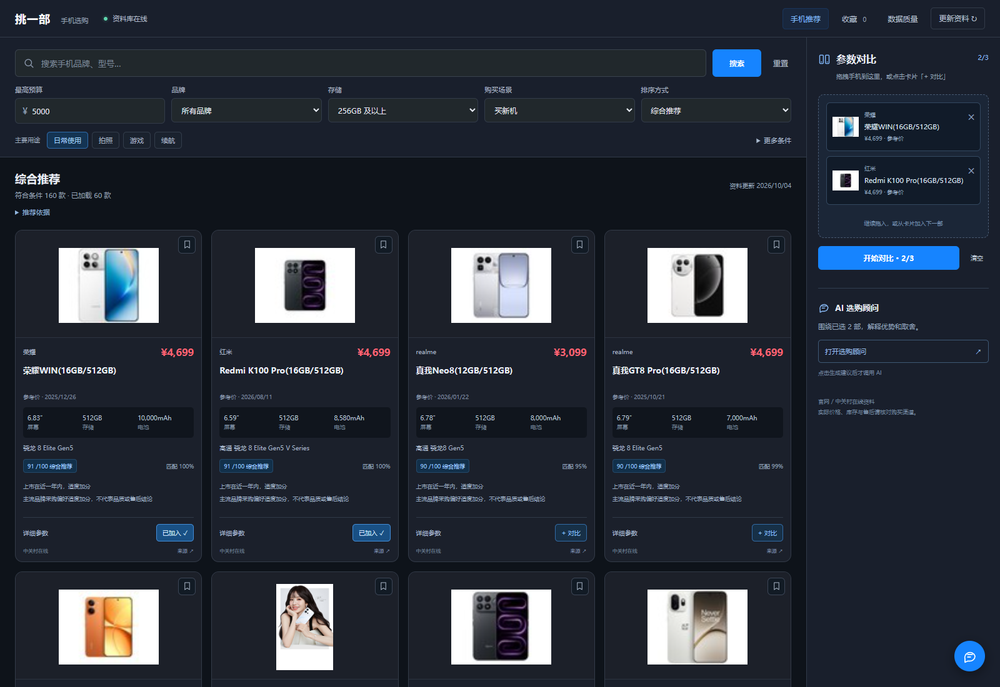
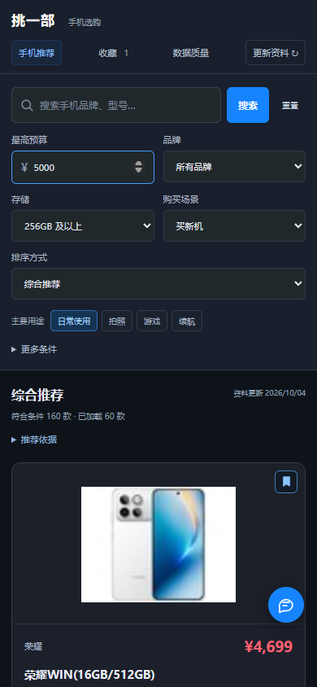
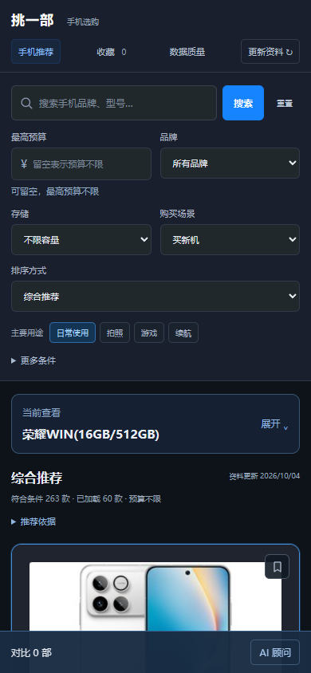
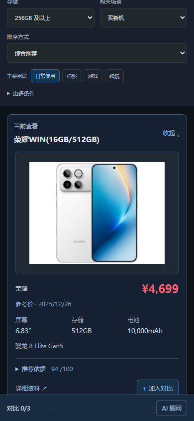
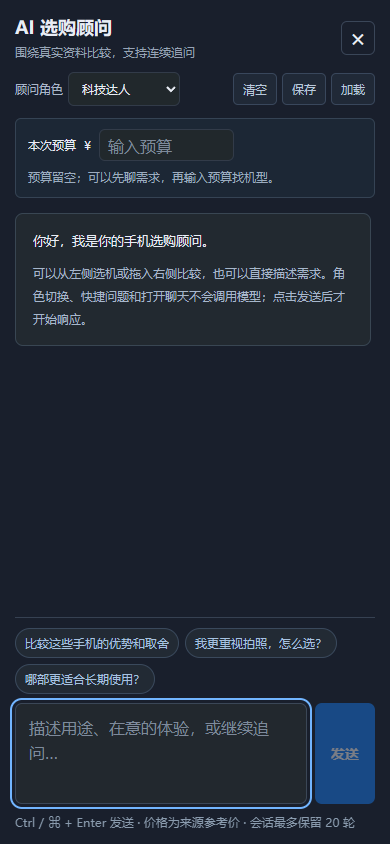
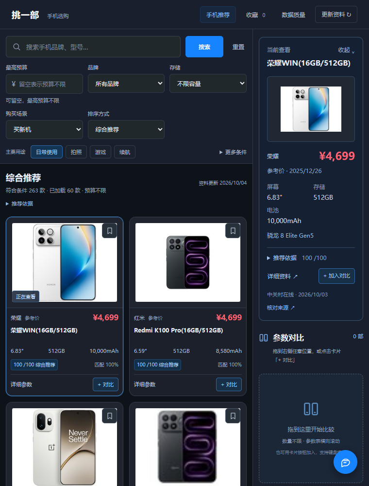
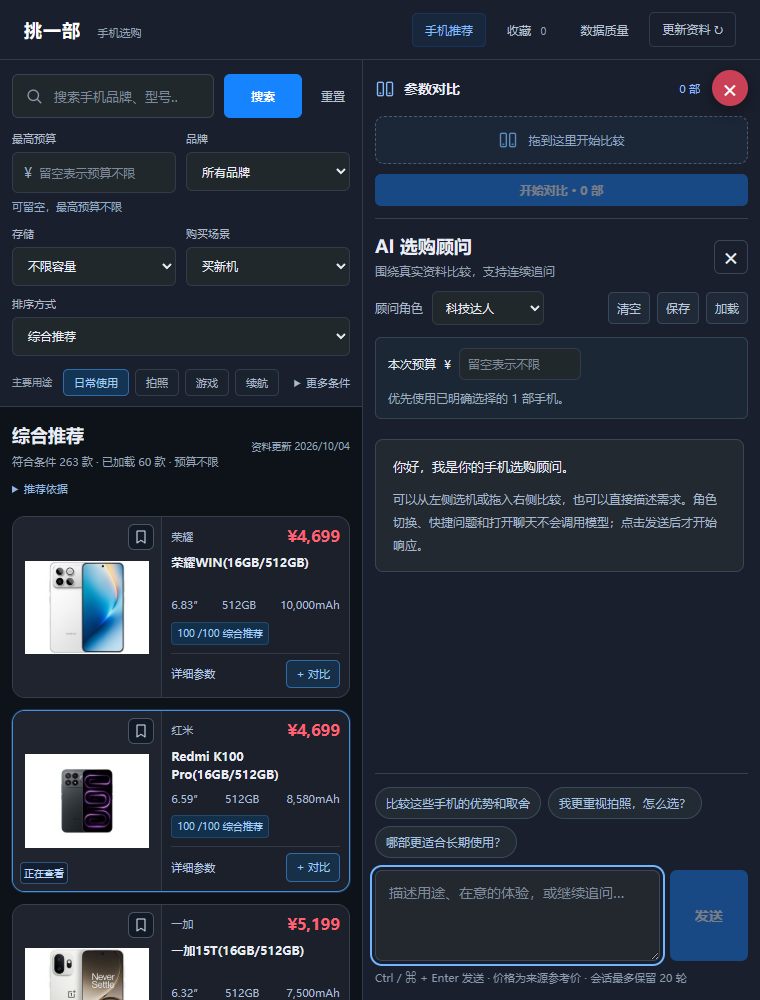
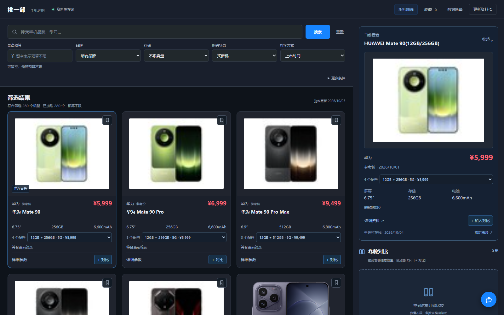
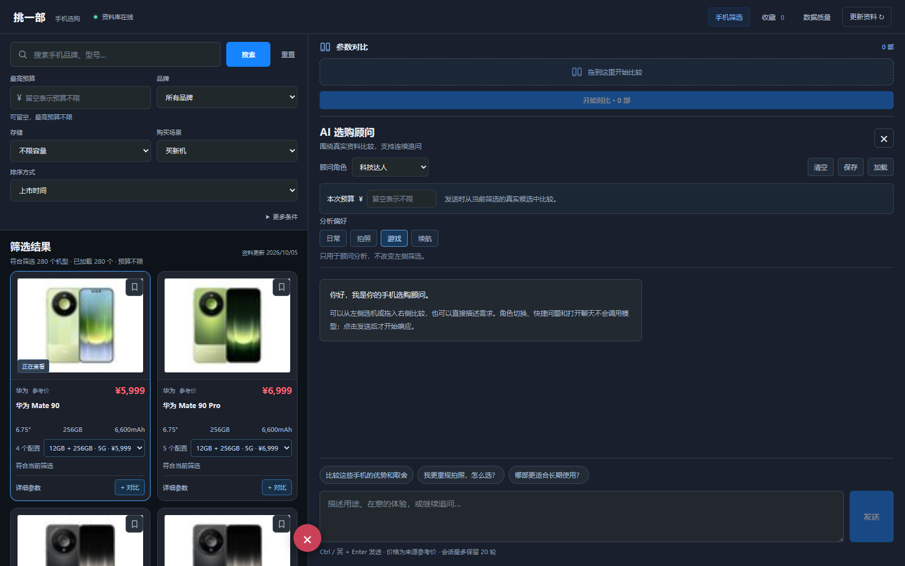

# 原版 UI 核查与恢复依据

> 现行交互已更新：预算可选、默认容量不限；搜索显示完整型号目录并标明历史／待核价／待上市状态；对比取消三台上限，参数表可横向滚动。本文保留各阶段恢复时的验证记录，早期“必须预算”“最多三台”描述不再是当前限制。最新规则见 [搜索与比较修复](SEARCH_AND_COMPARE.md)。

核查日期：2026-10-04。用户指出重建页面与原先深色、有动效的界面不同。本次先核对真实 Git 历史，再用可验证的原图恢复界面流程；不会把新写的 React 代码称为找回的原模板。

## 已找到的原版证据

相邻项目 `Get_Phone` 的本地真实 Git 历史来自 [Zhong-Ze-Wei/Get_Phone](https://github.com/Zhong-Ze-Wei/Get_Phone)。共找到 9 张旧界面截图，筛选三张保存在本项目 `docs/ui-reference/`，不会因清理运行日志丢失。

| 文件 | 原始父仓库提交 | 能确认的内容 |
| --- | --- | --- |
| [晚版手机工作台](ui-reference/ai_chat_test.png) | `29c3bb80b23f2ee486528a842ddbf77db2542144` | 真实商品图片、暗色紧凑参数卡、价格区、顶部筛选、右侧拖拽对比栏、底部分页 |
| [拖拽状态](ui-reference/chrome_test_results_2025_10_15.png) | `e2b472e90bed0fe641bfc593771ac2c1cd521e2a` | 卡片倾斜、半透明，对比投放区蓝色高亮 |
| [顾问展开](ui-reference/ai_testing_success.png) | `e2b472e90bed0fe641bfc593771ac2c1cd521e2a` | 从右侧展开的 AI 顾问与聊天/快捷提问区 |

晚版截图的原 blob 是 `383e00745739d6870d64e12333d69f443e9bb0e8`。另一组截图同一时期的子仓库指针是 `208c1f7d8371d9b08311719614746e163d714f07`。还找到三栏导购截图：左手机列表、中角色顾问与聊天、右对比；它不是本次采用的晚版手机工作台布局。

旧文档指向 `phone_recommendation_web/templates/index_optimized.html`，技术为 Flask、HTML/CSS/JavaScript 与 Bootstrap，描述流式 AI、五种角色和手机对比。截图能证明可见状态效果，不能证明具体动画曲线、时长或原 JavaScript 实现。

## 尚未取得的源码

父仓库网页相关历史从首次提交起仅保存 `160000` 子仓库 Gitlink，没有完整前端文件。末版子仓库指针 `fff50837dd127e510547fc48af1a96f0dfa4ebf0`，另一个版本为 `eb24be372cd9faeb2f6fd8e359a18b98ac78280d`。这些对象、原子仓库工作目录、`.git/modules`、历史 `.gitmodules` 都未在已检查的本地位置找到，stash 同样只保留指针。

GitHub 官方公开仓库列表未列出已识别手机仓库，访问私有仓库受限；正常 Git 认证路径还遇到 TLS 握手失败。该结果表示本次没有取得完整源码，不能断言私有仓库不存在或永久无法恢复。没有绕过访问控制、输出密钥或读取无关私人资料。

## 本次重建的范围

按晚版实物图工作台恢复暗色底色、紧凑顶部筛选、手机图与参数卡、右侧对比区。移除大幅营销首屏与抽象装饰，把选手机与比较作为主流程。拖拽与按钮都可加入对比；对比数量遵循当前 API 的最多三台，不能照截图写四台却让服务报错。浮动顾问入口和侧面板沿用已有真实 API；未操作不会调用模型。

动效围绕操作：卡片悬停、拖拽倾斜与透明、投放区高亮、侧面板过渡。减少动态效果偏好下关闭这些动画。移动端保留按钮对比和响应式布局，不要求触屏拖拽才能操作。

保留已经修好的来源、清洗、近期报价、显式预算、综合推荐与未知数据说明。初次预算为空，输入金额或选预算档后推荐；新机发现作为补充，超预算或待核价机型仍可找到。商品图只采用已有真实来源图片；缺图明确显示暂无来源图片，不生成或替用其他型号图片。

第一轮是依据历史截图重建的 React 页面，当时尚未恢复角色系统、连续问答、流式响应或聊天记录存储。后续用户指出 AI 球职责缺失，本轮已补齐真实聊天接口及配套交互，详见下文与 [AI 顾问说明](AI_CHAT.md)；原旧聊天记录文件没有取得。

## 第一轮恢复验收

`npm run build`、`npm test` 通过：254 项 Python 测试、13 项前端测试。真实运行的 `http://127.0.0.1:8501/` 已验收：

- 初始预算为空且没有推荐请求；输入明确预算后才推荐，清空与重置移除旧结果。
- 60 个实际返回候选的综合分逐项与后端分项权重吻合，预算有效且型号家族不重复。
- 真实鼠标拖拽和按钮均可加入对比，三台上限有效；参数对比和详情按实际 API 读取，收藏和 20 项分页正常。
- 打开 AI 抽屉不会请求模型；二手机型参考采用零时效权重，明确没有二手报价或库存。
- 搜索 X500、预算 4000 元时，无预算推荐但三款系列仍可在自动展开的新机补充中找到；主动放宽预算后进入推荐。
- 手机宽度 390px、单列、型号标题 14px，无横向溢出；减少动态效果时动画和过渡关闭。
- 预算 8000 改 2000 时，故意延迟新响应，上一批候选、旧分数和新品区立即隐藏，默认 AI 不可用；成功后只显示当前预算结果，模拟失败时也不沿用旧候选。取消的旧响应不能落盘。

当前桌面与手机截图：

运行过程记录位于 `logs/restored-ui-browser-check.json`、`logs/budget-race-browser-check.json`，日志不进入发布包。当前推荐权重、来源边界与二手机型参考规则见 [推荐策略](RECOMMENDATION_STRATEGY.md)。

## 图片卡片与双栏改版依据

用户再次指出卡片图太小、左右两块不清楚。本轮重新对照晚版截图，并实际操作了三个 21st 公开预览；只借用布局与交互原则，组件代码由本项目实现。

| 公开案例 | 实际观察 | 本项目采用的原则 |
| --- | --- | --- |
| [Product Image Card](https://21st.dev/@ruixen.ui/components/product-image-card) | 大图为主体，缩略图或箭头切换视角 | 右侧用大图展示选中手机；来源只有一张图时只展示该图，不编造多角度 |
| [Product Reveal Card](https://21st.dev/@isaiahbjork/components/product-reveal-card) | 默认媒体区约占卡高 57%，悬停时详情上滑 | 左侧提高图片占比、压缩重复说明；主体图片、价格、对比动作始终可见，键盘同样可操作 |
| [Split Hero With Image Cards](https://21st.dev/@felipemenezes098/components/hero-08) | 桌面双板清楚分开，手机上下排列 | 保留桌面左右分区与手机阅读顺序；比例按选机任务决定，不复制营销首屏 |

[21st 双栏指南](https://21st.dev/blog/split-screen-layout-components)还提供了移动阅读顺序和高于视口的固定面板处理原则。本项目以“看实物、点选查看、加入对比”为流程：左侧是图片图库，右侧是选中机型预览及最多三台对比。点击图片只改变预览，独立按钮或拖拽才加入对比。价格和核心规格常驻，完整分数依据与来源转到预览和详情，避免每张卡片重复一大段策略说明。

选中状态与当前请求及收藏视图绑定：预算、用途、排序等变化时立即隐藏上轮预览，不能在新条件下展示旧分数。首次预算仍为空。手机采用单列和可展开预览；减少动态效果时关闭位移、缩放和过渡。

图片问题同时从采集端解决：优先读取源页面实际产品主图，保留来源与原采集时间；不按字符串替换猜测高清地址，不生成商品图。图片补采不使报价或库存变新。具体规则与离线回放说明见 [图片采集与修复](IMAGE_PIPELINE.md)。

### 双栏图库验收

`npm run build`、`npm test` 通过：263 项 Python 测试、14 项前端测试。运行中的 8501 页面已完成 38 项浏览器检查，报告位于 `logs/image-gallery-browser-check.json`：

- 1600×1000 桌面：左侧三列，右侧 480px，占宽 30%；首卡图区 268.48px / 卡高 466.39px，约 57.6%。无横向溢出。
- 点图与 Enter 选择均更新当前预览，不加入对比，也不发送推荐或模型请求；真实拖拽和独立按钮均可加入，三台上限有效。
- 详情和比较调用真实 API；打开顾问没有模型调用。重置清空预算、预览和对比。
- 故意延迟预算 8000→2000 的响应时，旧卡片和旧预览立即隐藏；返回后仅显示当前结果及其首台预览。60 台实际候选的综合分与后端权重逐项吻合。
- 390×844 手机：单列、型号标题 14px、图片区约 56.8%；触屏点图展开正确预览，无隐式对比。减少动态效果时动画与过渡关闭。
- 分页、二手机型参考和 X500 超预算新品补充仍可使用。浏览器未出现 JavaScript 异常，本轮未调用模型。
- 主图发布后，浏览器实际取得 280×210 / 320×240 图片，不是原 80×60 图在 CSS 中放大；测试还故意使收藏中的旧图片失败，在同一个卡片 DOM 内取得新真实地址后成功恢复。
- 手机顾问入口收进底部操作条，避免浮动按钮遮挡电池参数。零台对比时仍可围绕当前推荐打开顾问，两台起可开始比较；实际触屏打开顾问没有模型调用，底栏无溢出，手机参数对比也读取真实 API。

截图中的 8000 元由验证脚本主动输入，首次预算仍为空。

## 整栏拖拽与 AI 球完整职责恢复

用户指出拖拽只剩右下角小框，以及 AI 球只剩一次解释。本轮把投放事件移到整个右侧工作区，预览标题、大图说明、空白和展开后的聊天标题、输入区都能投放；球在拖动中让出鼠标事件。比较仍最多三台，去重、真实内部拖拽校验和取消清理集中处理。

再次核对 [旧展开截图](ui-reference/ai_testing_success.png) 与真实历史角色文档后，恢复约 1/3 左图库、2/3 右聊天的桌面布局。它是可继续浏览和拖拽的工作区；关闭回到原来的大图预览布局。五角色、快捷填入、真实流式回复、连续追问、停止、清空及本地保存／加载都有真实实现。手机提供可关闭的聊天工作区。预算为空也能打开，只有发送才请求模型。

详情里明确咨询某台手机，使用该台作为上下文，不会被常驻对比列表覆盖；从对比面板咨询则使用该组。普通开球恢复当前选择规则。聊天历史只解释需求，价格和规格每轮读取当前规范数据，每条回答的来源编号独立保留。完整接口、取消和本地存储边界见 [AI 顾问说明](AI_CHAT.md)。

### 本轮验收

- 生产构建和统一测试通过：299 项 Python、28 项前端测试。
- 当前 8501 页面完成 43 项整栏拖拽、流式会话、来源及手机交互检查，另有 15 项明确咨询目标、真实拖拽取消、旧响应隔离及刷新后加载检查。
- 真正鼠标拖到预览标题／正文、顶部文字、聊天标题／输入框均只加入一次。跨子元素保持整栏高亮，取消后高亮消失；球不拦截，外部普通文本拒绝，重复和三台上限有效。
- 通过本地可控延迟 SSE 验证正文在完成前增量可见；停止、关闭、变预算或对比机型后旧回复不能继续写入，局部／失败／EOF／输出截断不冒充已完成历史。第 13 条来源仍可引用、保存和加载。
- 无预算开球、角色切换和快捷填入零模型请求；预算显式同步主筛选，修改后保留已完成对话。保存加载不修改预算、筛选或对比；刷新后预算仍为空，只有手动加载才恢复文字。
- 从 A 对比栏进入 B 详情咨询，实际请求 ID 为 B；随后新增 C 则使用 A、C。默认首台预览不冒充主动选择，对比面板咨询使用明确对比组。
- 真实 DeepSeek 流另行验证两轮，带连续历史的第二轮正确读取真实三台候选参考价；浏览器专项使用可控流，不重复消耗模型额度。

报告在 `logs/global-drop-chat-browser-check.json`、`logs/advisor-target-browser-check.json` 和 `logs/live-chat-check.json`。下图中的 8000 元是验收主动填写，手机欢迎界面的预算为空；截图没有伪造模型答案。

## 窄电脑窗口的图库密度（2026-10-04）

旧版在窗口宽度不超过 900px 时就切换手机交互：选择图片会把展开预览插到图库上方，顾问使用全屏对话框；稍宽时右栏又至少占 380px。电脑窗口缩窄或并排使用应用时，图库因此只能展示很少的手机。

本版将手机工作区断点同步调整到 600px。601–1370px 保留左右布局，预览右栏在 240–340px 之间适应窗口；顾问打开后优先给双方足够的操作空间。筛选区和图卡按**图库实际宽度**调整密度，图库宽度达到 620px 时排三列，更窄时排两列；宽桌面的常规大图布局继续使用原来的间距。541–600px 使用全宽两列，540px 及以下使用手机单列和底部操作条。

聊天时图库达到 440px 即排两列，否则用横排的图片与规格卡片，继续保留收藏、详细参数和对比按钮。宽电脑窗口展开顾问后，左侧图库同样按实际宽度排版。窄窗口中的 AI 球展开后位于右栏顶部，用于收起聊天，避免遮住手机名称和操作按钮。右侧窄预览的标题、价格和参数也单独调整，电池容量与单位保持完整。

| 实测窗口 | 常规浏览 | 顾问展开 |
| --- | --- | --- |
| 760×1000 | 两列，首屏可见手机从 2 台增加到 4 台 | 横排图卡；左侧可以继续浏览，右侧聊天 |
| 900×1000 | 三列，首屏可见 6 台 | 横排图卡，继续使用左右工作区 |
| 1024×1000 | 从两列增加到三列，首屏可见 6 台 | 从一列增加到两列 |
| 1600×1000 | 保留原三列大图 | 左侧从一列增加到两列 |
| 390×844 | 保留手机单列、折叠预览和底部操作条 | 可关闭的全屏顾问 |

首屏可见数量包含下一行已经进入屏幕的图片，并不表示所有这些卡片的参数都完整露出。760px 下点选图片不会改变图库起点或自动滚动，预览只更新右栏。

验收使用运行中的 8501 页面与真实读取接口，覆盖 390、540、600、601、640、760、900、1024、1280、1370、1600px 共 11 种宽度及聊天开关：无页面或卡片横向溢出；600↔601px 跨断点切换聊天后仍可关闭，并保留已选对比。真实鼠标拖到预览右栏或聊天标题均能加入；多机参数表仍能横向查看，窄窗口中全部 47 款 iPhone 目录可以翻页访问。本轮未发送模型请求，浏览器无 JavaScript 异常。

`npm run build`、`npm test` 通过：33 项前端测试、336 项 Python 测试。49 项浏览器断言记录在本地 `logs/narrow-desktop-verification.json`，各尺寸测量在 `logs/narrow-desktop-browser.json`；验收日志不进入发布包。

## 手机筛选与手动分析（2026-10-06）

主工作台现在用于筛选手机资料。综合推荐分、需求匹配分、固定权重排序及其规则点评已移除；型号卡、预览、详情和参数对比均展示真实配置、参考价与来源。默认按来源给出的上市时间展示，也可选择价格由低到高或由高到低。同型号先显示符合条件的最低已核报价配置，其他容量仍可在卡内切换；完整筛选结果继续分页，不截断为前 60 个型号。

用途按钮移到右侧「AI 分析偏好」，默认不预设用途。选择日常、拍照、游戏或续航不会重新筛选图库，也不会清空已选容量或比较机型。打开顾问、选择角色和调整分析偏好都不请求模型；详情／比较的分析入口会准备当前机型与问题，用户点击发送后，顾问才按当前资料与所选真实配置解释取舍。

原有大图、左右预览、整个右栏接收拖拽、可比较多种容量，以及窄电脑窗口两列／三列密度继续保留。详细筛选和报价边界见 [手机筛选策略](RECOMMENDATION_STRATEGY.md)。下列截图来自本轮实际运行页面，旧日期章节保留当时的界面和验收记录。

